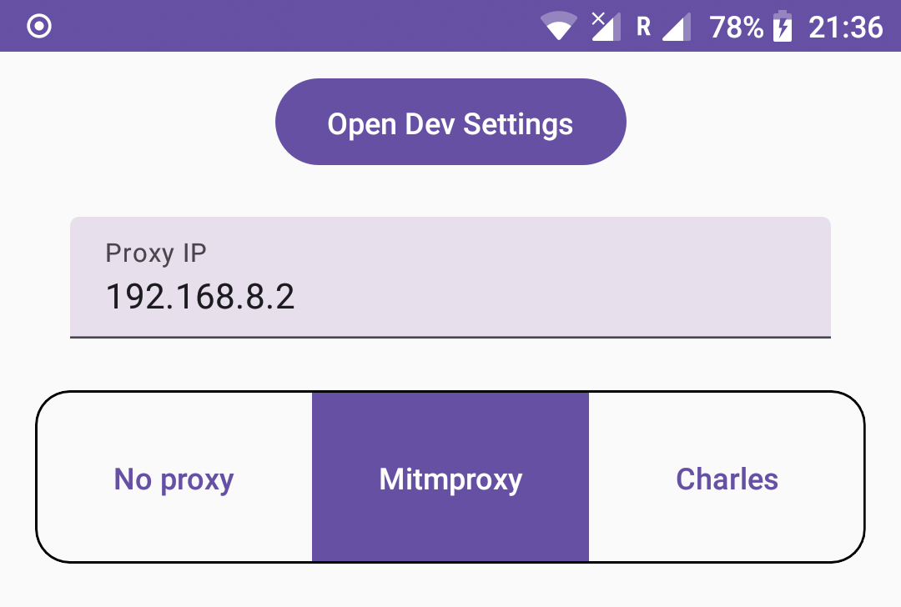

# DevTools

A simple app for speeding up developer actions.



### Fast developers settings

Some ROMs and versions of Android have a fast button to open Developer settings, but not all, and these buttons are
placed in different locations. So, I created the only button for this purpose.

### Proxy switcher

I had some specific projects where I needed to frequently change the proxies. This was necessary for saving sessions
with Charles, conducting faster investigations with Mitmproxy, and handling specific requests without a proxy. So, I
implemented this feature.

# Installation

To be able to use Proxy switcher install the app as system or run in terminal:

```
adb shell pm grant com.valllent.devtools android.permission.WRITE_SECURE_SETTINGS
```

And then activate `Modify system settings` in the app settings. 